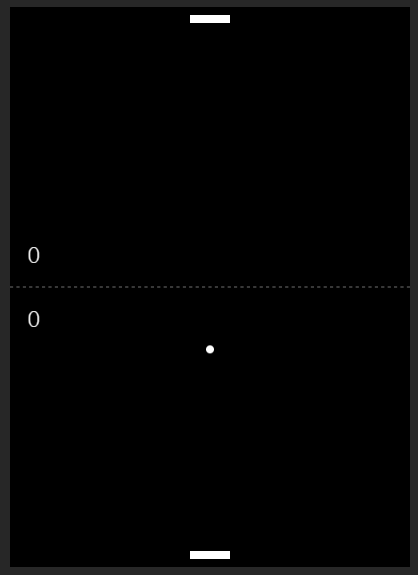

# Pong Game

A classic Pong game implemented in HTML, CSS, and JavaScript. Play against the computer and see if you can score more points!

## Table of Contents
- [Introduction](#introduction)
- [Gameplay](#gameplay)
- [Controls](#controls)
- [Play the Game](#play-the-game)
- [Game Rules](#game-rules)

## Introduction
Pong is a simple and timeless arcade game where players control paddles and try to hit the ball past their opponent's paddle to score points. This repository contains the code for a basic Pong game implemented using HTML, CSS, and JavaScript.

## Gameplay
In this Pong game, you control the bottom paddle, and the computer controls the top paddle. The objective is to score points by bouncing the ball past the computer's paddle. The first player to reach the winning score (default: 7) wins the game.

## Controls
- *Mouse Movement:* Move your paddle horizontally by moving your mouse left and right.
- *Play Again:* After a game ends, click the "Play Again" button to start a new game.

## Play the Game
You can play the game [here](https://jspong-game.netlify.app)

## Game Rules
- The game is won by the first player to reach the winning score (default: 7).
- If the ball passes your paddle and reaches the bottom of the screen, the computer scores a point.
- If the ball passes the computer's paddle and reaches the top of the screen, you score a point.
- The ball's speed increases with each successful hit of your paddle.
- The computer's paddle moves to try and intercept the ball's trajectory.
